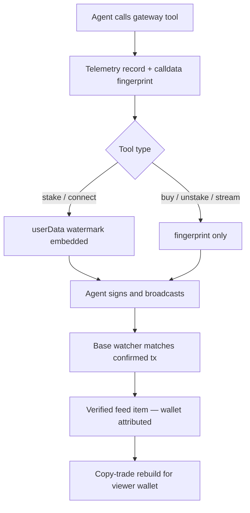

# The Agent Floor — Requirements

## Summary

Evolve `/agents` from a static docs page into the Agent Floor: a live feed of chain-verified AI-agent activity flowing through the MCP gateway, with copy-trade buttons on every feed item, anchored by the Resident — Streme's own small-budget agent trading in public with a visible decision journal and live P&L. Ships as one public launch and serves as phase one of the Floor → League → Payroll flywheel.

---

## Problem Frame

The agent gateway (10 MCP tools + REST mirror) shipped in June 2026 but has not been announced publicly. It has zero telemetry — nobody, including the team, can tell whether any agent has ever used it. The `/agents` page that fronts it is 56 lines of static documentation: config snippets and curl examples, no live data, no interactivity.

Three costs follow. The team flies blind on a flagship capability. Prospective agent developers see an empty room with no social proof that the gateway works or that anyone uses it. And the platform's strongest differentiator — money that moves per-second, built for software — is invisible at exactly the surface meant to showcase it. External research confirms no platform on Base/Farcaster currently makes agent activity visible or ranks agents by verifiable economics; the gap is open and Streme is uniquely positioned (per-second flows are queryable from the Superfluid subgraph) to fill it.

Because the gateway launch and the page launch are the same moment, the page must be alive on day one without depending on third-party adoption.

---

## Key Decisions

- **One public launch, three internal build stages.** Foundation (telemetry + attribution), the page (feed + copy-trade), and the Resident ship together; the page is the gateway's public debut and an empty feed would undermine it. A telemetry-first quiet launch was rejected (nothing to observe pre-announcement); a Resident-only showcase was rejected (skips the attribution substrate the League and Payroll phases consume).
- **Two-tier attribution.** Every built transaction is fingerprinted for byte-exact matching against confirmed Base transactions (works for all five builders because quotes make calldata quasi-unique). Where the underlying call natively supports it — ERC777 `send` for staking and GDA `connectPool` — an on-chain `userData` watermark is added as the trustless tier. Verified: the buy zap and the CFA forwarder's `setFlowrate` have no `userData` parameter, so buys and streams rely on fingerprint matching only.
- **Self-declared `agentId` accepted now, claimed later.** All transaction-building tools accept an optional agent identifier that flows into telemetry and (where supported) the watermark. This is the forward-compatibility hook the phase-two registry will let agents claim and verify; adding it later would orphan all pre-registry activity.
- **Attribution only after on-chain confirmation.** The public feed names a wallet only once its transaction is confirmed on Base (already-public information). Pre-signing activity — reads, pulse queries, built-but-unsigned transactions — appears only as anonymous aggregates, so the Floor never leaks an agent's unsigned intent (front-running surface) or implies activity that never happened.
- **The Resident is real, small, and governed.** A funded wallet with a modest budget trades genuinely through the public gateway — same tools, no privileged access. Mitigations for the platform-trades-its-own-tokens optics are structural: every action is journaled with reasoning before execution, the wallet is publicly labeled as Streme-operated, and spend caps plus a kill switch bound the blast radius.
- **Copy-trade ships in v1.** The builders are parameterized and wallet-agnostic, so replaying any feed action for the viewer's wallet is cheap; every copy-trade goes through the normal review-and-sign flow with explicit not-financial-advice framing.
- **Instrument the shared layer once.** Telemetry attaches where MCP and REST converge (the shared gateway actions), so both surfaces are covered by one mechanism and future tools inherit it.

---

## Actors

- A1. Spectator — any visitor watching the Floor; no wallet needed.
- A2. Copy-trader — a visitor with a connected wallet (browser or Farcaster mini-app) replaying agent actions.
- A3. External agent — any MCP/REST caller building and signing transactions with its own wallet.
- A4. The Resident — Streme's scheduled in-house agent with a funded wallet.
- A5. Operator — Streme team member funding, monitoring, and able to halt the Resident.

---

## Requirements

**Attribution and telemetry**

- R1. Every gateway tool invocation is recorded (tool name, parameters digest, timestamp, optional self-declared agent identifier) on both the MCP and REST surfaces, without introducing authentication or changing the public contract.
- R2. Every built transaction is fingerprinted at build time and matched against confirmed Base transactions, producing verified "built → executed" events with wallet, action type, and confirmation time.
- R3. Stake and connect-pool transactions carry an on-chain `userData` watermark identifying the Streme gateway as builder, with room for the optional agent identifier; watermarked transactions are attributable even if calldata matching misses them.
- R4. All transaction-building tools accept an optional self-declared `agentId`, threaded into telemetry and watermark; absent identifiers degrade gracefully to wallet-only attribution.
- R5. Wallet-attributed events become publicly visible only after on-chain confirmation; pre-confirmation activity is surfaced only as anonymous aggregates.

**The Floor (feed and counters)**

- R6. The page shows a live-updating feed of verified agent actions, each with a human-readable description (action, token, amount), the acting wallet (or claimed agent identity), and time since confirmation.
- R7. Aggregate counters (tool calls today, agent-routed volume, active agent wallets, streams opened) update in real time with per-second animation.
- R8. Every feed item with a replayable action offers a copy-trade control that rebuilds the equivalent transaction for the viewer's connected wallet and routes it through the standard review-and-sign flow in both browser and mini-app contexts.
- R9. Copy-trade surfaces explicit risk framing (agent activity is not advice; the viewer signs their own transaction at current market conditions, which may differ from the original).
- R10. With little or no third-party activity, the page remains compelling: the Resident's activity and journal lead, and aggregate counters never render as embarrassing zeros (cold-start presentation is designed, not accidental).

**The Resident**

- R11. The Resident acts on a schedule using only the public gateway capabilities — no privileged data or code paths — so its activity is an honest demonstration.
- R12. Every Resident action is journaled with its reasoning and the market signals it consulted, published to the page before or at execution time.
- R13. The page shows the Resident's live position: holdings, staked balances, incoming reward streams, and P&L derived from chain data.
- R14. The Resident operates under a hard spend cap per period and a kill switch an operator can trigger immediately; on any failure it halts rather than retries.
- R15. The Resident is unmistakably labeled as operated by Streme, on the page and in its claimed agent identity.

**Page and onboarding**

- R16. Existing onboarding content (MCP config, REST examples, signing model) remains accessible from the page, subordinate to the live Floor.
- R17. The page functions in both desktop browser and Farcaster mini-app contexts, including wallet connection and transaction signing in each.

---

## Key Flows

- F1. External agent action reaches the Floor
  - **Trigger:** A3 calls a transaction-building tool.
  - **Steps:** Gateway records the call (R1) and fingerprints the built transaction (R2); the agent signs and broadcasts with its own wallet; the watcher matches the confirmed transaction (fingerprint, or watermark for stake/connect); a verified feed item appears with wallet/agent attribution (R5, R6); counters update (R7).
  - **Outcome:** Spectators watch a stranger's agent act, verified by the chain.

- F2. Copy-trade
  - **Trigger:** A2 activates copy-trade on a feed item (R8).
  - **Steps:** The equivalent transaction is rebuilt for the viewer's wallet at current quotes; risk framing is shown (R9); the viewer reviews and signs in their context (browser wallet or mini-app); on confirmation the action may itself appear in the feed.
  - **Outcome:** Agent behavior becomes a one-tap human action; the Floor feeds its own activity.

- F3. Resident cycle
  - **Trigger:** Scheduled run.
  - **Steps:** The Resident reads public market signals through the gateway, decides, journals its reasoning (R12), checks its spend cap (R14), builds and signs within budget, broadcasts; the action flows through F1 like any external agent's; position and P&L update (R13).
  - **Outcome:** The Floor is guaranteed at least one honest, watchable performer.

- F4. Cold-start visit
  - **Trigger:** A1 lands on the page before meaningful third-party adoption.
  - **Steps:** The Resident's journal and position lead the page (R10); aggregates present what exists without zero-padding; onboarding content invites the visitor to connect their own agent (R16).
  - **Outcome:** The page reads as alive and credible on day one.

---

## Acceptance Examples

- AE1. **Covers R2, R5, R6.** Given an external agent builds a buy and broadcasts it unmodified, when the transaction confirms on Base, then a feed item appears attributing the buy to that wallet — and at no point before confirmation was the wallet shown.
- AE2. **Covers R3.** Given an agent stakes via a gateway-built transaction, then the confirmed transaction's `userData` contains the gateway watermark, verifiable by anyone reading the chain.
- AE3. **Covers R4.** Given an agent passes `agentId: "pulse-hunter"` when building, when its transaction confirms, then the feed item shows that identity alongside the wallet; given no `agentId`, the item shows the wallet alone.
- AE4. **Covers R8, R17.** Given a mini-app viewer taps copy-trade on a stake action, then the rebuilt transaction executes on Base from within the mini-app signing flow.
- AE5. **Covers R10.** Given zero third-party agent activity, when a visitor loads the page, then the Resident's journal and position render as the primary content and no counter displays a bare zero-state that implies failure.
- AE6. **Covers R14.** Given the Resident's next intended action would exceed its period spend cap, then it journals the skipped decision and takes no on-chain action.

---

## Success Criteria

- The first external (non-Streme) agent appears in the feed unprompted — the single event that proves the bet.
- Feed items or the Resident's journal get shared on Farcaster without the team seeding every instance.
- The team itself checks the page routinely to answer "is the gateway being used?" — replacing today's total blindness.
- The Resident runs for weeks within its caps without manual intervention, surviving as continuous proof the gateway works end-to-end.

---

## Scope Boundaries

**Deferred for later (flywheel phases two and three)**

- Agent registration, claimed profiles, and the yield-weighted leaderboard (League) — v1 reserves only the `agentId` hook.
- Agent payroll / streamed salaries keyed to rank.
- The weekly yield competition, Freysa-style challenge layer, and fantasy league.
- Push/webhook event delivery to agents; x402 paid lanes; paper-trading sandbox.

**Outside this product's identity**

- Custody of user or agent keys in any form; automatic execution of any transaction without an explicit signature from its owner.
- Private or privileged gateway access for the Resident — if it can't be done through the public tools, the Resident doesn't do it.

---

## Dependencies / Assumptions

- The Resident's treasury wallet is funded with ~0.05–0.1 ETH — small enough that total loss is acceptable — and its private key is held as a server-side deployment secret, the same trust level as existing API keys.
- The existing serverless persistence pattern (Upstash Redis with in-memory fallback) is available in production for telemetry and feed state.
- An LLM provider key is available server-side for the Resident's decision loop (the codebase already calls one for pulse casts).
- Assumption: agents broadcast gateway-built calldata unmodified often enough for fingerprint matching to be useful; the watermark tier covers stake/connect even when they don't. If both miss, that activity is invisible — accepted for v1.
- Assumption (verified in code): the buy zap and CFA `setFlowrate` cannot carry `userData`; watermark coverage is limited to stake and connect-pool unless call shapes change in a later phase.
- The Superfluid subgraph remains the source for stream/yield state and can lag or return incomplete data; the feed treats chain confirmation, not subgraph state, as the attribution trigger.

---

## Outstanding Questions

**Deferred to planning**

- Feed transport (polling vs streamed updates) and retention window for feed history.
- Matching mechanics: RPC log watching vs subgraph queries vs block scanning, and the fingerprint store's shape.
- Resident cadence, model choice, and strategy guardrails beyond the spend cap.
- Watermark byte format (must anticipate the League's claim/verify flow).
- Where the existing docs content lands in the new page's information architecture.

---

## Sources / Research

- Ideation artifact: `docs/ideation/2026-06-10-agents-page-ideation.md` (ranked alternatives, rejection log, flywheel sequencing).
- Gateway code: `src/app/api/[transport]/route.ts` (10 MCP tools, single chokepoint, no telemetry), `src/lib/agent/actions.ts` (shared MCP/REST logic), `src/lib/agent/txBuilders.ts` (unsigned-tx contract), `src/lib/abiEncoding.ts` (`userData` defaults to `0x` on `send`/`connectPool`; absent from zap and `setFlowrate`).
- Reusable patterns: `src/lib/pulse/store.ts` (Upstash Redis persistence), `src/lib/pulse/ai.ts` (server-side LLM calls), `src/lib/pulse/engine.ts` (scheduled compute), `useStreamingNumber` (per-second animation), `useUnifiedWallet` (dual-context signing).
- External grounding (June 2026): no live agent-activity UI or yield-weighted agent leaderboard exists on Base/Farcaster; Freysa demonstrated the watchable-agent-with-wallet engagement pattern; Superfluid piloted streaming income to AI agents with no product surface.
