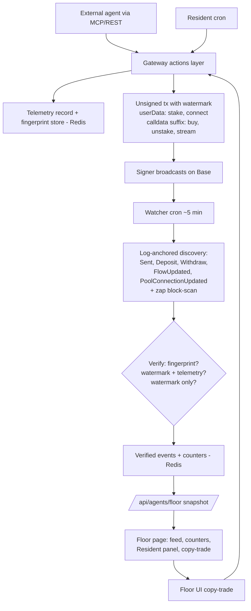
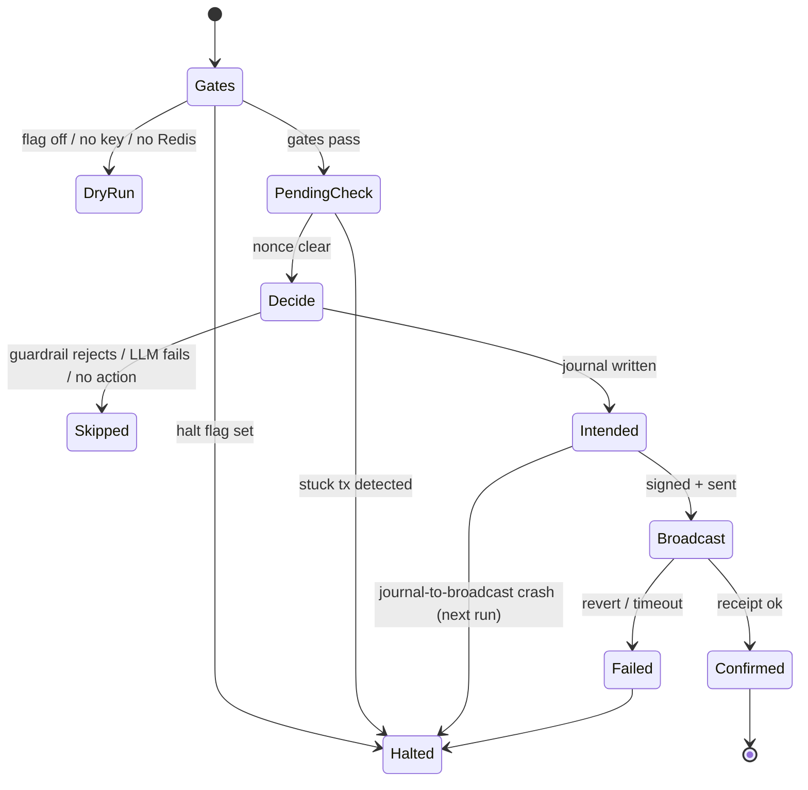

# feat: The Agent Floor — live chain-verified agent activity on /agents

## Summary

Evolve `/agents` from a static docs page into the Agent Floor: instrument the MCP/REST gateway with telemetry and on-chain watermarks, run a cron watcher that matches gateway-built transactions to confirmed Base activity, render a live feed with copy-trade buttons, and launch the Resident — a guarded, small-budget house agent trading through the public gateway with a public decision journal and P&L.

---

## Problem Frame

The agent gateway shipped unannounced with zero telemetry; nobody can tell whether any agent uses it, and the `/agents` page fronting it is static documentation (see origin: `docs/brainstorms/2026-06-10-agent-floor-requirements.md`). The page and the gateway launch together, so the page must be alive on day one without third-party adoption. This plan is phase one of the Floor → League → Payroll flywheel: the watermark format and telemetry schema deliberately anticipate the phase-two registry (claimable `agentId`) and ranking queries.

Contracts research upgraded the origin's attribution assumption: `StakingHelperV2.tokensReceived` ignores `userData` entirely, and none of the zap/forwarder targets inspect `msg.data`, so trailing-calldata watermarks are behaviorally inert — **all five transaction types** can carry an on-chain watermark, not just stake/connect as the origin doc assumed.

---

## Requirements

Origin requirements R1–R17 (attribution/telemetry, the Floor, the Resident, page/onboarding) are carried forward as the product contract, with one amendment: origin R2's fingerprint matching and R3's watermark are unified into the dual-channel watermark scheme below (origin AE2 strengthens accordingly — stake watermarks are verifiable from event logs). Plan-added requirements, continuing origin numbering:

- R18. The token blacklist (`SPAMMER_BLACKLIST` / `BLACKLISTED_TOKENS`) is enforced on single-token lookup and every transaction-build path, and blacklisted tokens never render in the feed. (Today only `listTokens()` filters — `getToken()` and all `build*ForToken` paths bypass it.)
- R19. Every built transaction is byte-unique: the watermark embeds a nonce so identical-parameter builds map to distinct fingerprints (prevents cross-agent misattribution on no-entropy builds like stake/connect).
- R20. Feed items display a verification tier; the "gateway-built" badge renders only for events corroborated by a fingerprint or telemetry record — watermark-bytes-alone (spoofable) shows activity without the badge.
- R21. `agentId` is sanitized (charset + length cap), reserved prefixes (`streme*`, the Resident's name) are rejected, the value always renders alongside the wallet address, and is labeled self-declared. The Resident is identified by its configured wallet address, never by `agentId`.
- R22. Floor persistence (fingerprints, verified events, counters, Resident journal/halt/spend ledger) requires live Redis in production — no silent in-memory fallback. The Resident fails closed: no Redis round-trip → dry-run only.

---

## Key Technical Decisions

- **Dual-channel watermark, all five builders.** Stake and connect-pool carry the watermark in native ERC777/GDA `userData` (verified ignored by `StakingHelperV2.tokensReceived`; surfaced in `Sent` / `PoolConnectionUpdated` event logs, which survives 4337/smart-wallet calldata wrapping). Buy, unstake, and stream append the watermark as trailing calldata after the ABI-encoded args (verified inert: no zap variant or forwarder inspects `msg.data`). Format (directional): magic bytes + version + source byte (`agent` | `floor-ui`) + 8-byte `agentId` hash + 4-byte nonce. Decode is tolerant of absence.
- **Verification tiers for display.** Anyone can stamp the magic bytes, so attribution is tiered: (1) fingerprint match — we issued these exact bytes; (2) watermark + telemetry record; (3) watermark-only — rendered as activity, no gateway-proof badge. Tier metadata is stored per event so the phase-two League can weight by trust.
- **Log-anchored discovery, tx-input verification, plus a zap block-scan.** The watcher anchors on event logs per action type — ERC777 `Sent` with `to = StakingHelper`, `StakedToken` `Deposit`/`Withdraw` (topic-anchored across addresses within the cursor window), CFA `FlowUpdated`, GDA `PoolConnectionUpdated` — then verifies the watermark from event `userData` where present, else by substring scan of `tx.input` (substring, not exact-suffix, so wrapped calldata still matches). Unstaked buys have no log anchor (zap contracts emit zero events — verified), so the watcher also scans blocks in the cursor window for `tx.to == ZAP_CONTRACT_ADDRESS` (~150 blocks per 5-minute run on Base; feasible within `maxDuration`).
- **Watcher correctness basics are non-negotiable.** Redis cursor (last processed block); publish only at head − ~15 confirmations (≈30 s on Base — kills shallow-reorg risk); dedupe by `txHash + logIndex`; never advance the cursor past a failed RPC range; Redis lock against overlapping runs; time-budgeted chunked backfill after downtime. Stake success requires the `Deposit` event in the receipt — a watermarked `Sent` that hit the `TokenNotSupported` refund branch (V2 tokens can disable staking) is recorded as a refund, never a successful stake. Filter `StremeAutoStaker` 1-wei `Deposit` dust.
- **Telemetry at the shared actions layer; a floor-specific store.** One instrumentation point in `src/lib/agent/actions.ts` covers MCP and REST. A new `src/lib/floor/store.ts` uses Upstash Redis with `LPUSH`/`LTRIM` capped lists and `INCR` daily counters (the pulse store's read-modify-write lists are racy for this) and **refuses the in-memory fallback in production** (loud failure). Fingerprint records (hash of `to + data` → tool, agentId, built-at) get a 48 h TTL — agents may sign long after building.
- **Pulse-pattern serving, not push.** The watcher cron persists verified events; `/api/agents/floor` serves a snapshot with `s-maxage` caching; the page polls ~60 s (the `/pulse` pattern). Per-second motion comes from client-side animated counters (`useRewardCounter`), not transport. SSE/websockets are deferred follow-up work.
- **Copy-trade matrix: buy and stake only.** Replaying an unstake would send the viewer's funds to the original agent's `to` address; replaying a stream opens an unbounded payment to the original receiver. BUY replays with a fresh quote; STAKE replays only when the viewer holds the token, otherwise the UI offers buy-with-auto-stake as the copy. Token state (blacklist, staking address, pool) is revalidated at rebuild time, with a "no longer available" UI state. Copy-trades carry `source = floor-ui`, appear in the feed labeled as human copies, and are excluded from agent counters.
- **Headline counters are chain-verified only.** Agent volume, active agent wallets, streams opened — all derived from verified events. Raw tool-call counts (authless, spammable via curl loop) render as a secondary, best-effort stat.
- **The Resident fails closed and is governed outside the LLM.** Gate function (pulse house style): `RESIDENT_ENABLED === "true"` + `RESIDENT_PRIVATE_KEY` + `ANTHROPIC_API_KEY` + a successful Redis round-trip, else dry-run. Hard guardrails live in code, not prompts: action allowlist (buy, stake, connect-pool — **no streams in v1**: one `setFlowrate` inside the cap commits unbounded outflow), per-run action limit, per-token and per-day ETH spend caps counted at broadcast time, minimum token age/liquidity floor, and a pending-nonce check at run start — a stuck transaction halts the Resident (origin R14: halt, don't retry). Kill switch = Redis halt flag behind an authed admin endpoint (env flags need a redeploy). Token names/symbols/pulse reasons are untrusted input: delimited in the prompt with an explicit instruction, and journal text is sanitized before rendering.
- **Journal entries are a state machine.** `intended → broadcast(txHash) → confirmed | failed`, plus terminal `skipped` (guardrail rejection) and `halted`. The journal write happens before broadcast; if the write fails, nothing is broadcast. A crash between `intended` and `broadcast` is visible as a dangling intention the next run marks `halted` — operators can always distinguish halt from crash (origin R12/R14).
- **First server-side signer in the repo.** The Resident's wallet is a viem account from `RESIDENT_PRIVATE_KEY` over the existing fallback transport. ~0.05–0.1 ETH funding; key as a deployment secret (decided in origin). No other code path may import the signer.

---

## High-Level Technical Design

Attribution and serving pipeline:



Resident run lifecycle:



---

## Output Structure

```text
src/lib/floor/
  store.ts          # prod-guarded Redis store: events, counters, fingerprints, cursor, locks
  telemetry.ts      # tool-call recording + fingerprint writes
  watcher.ts        # discovery, verification tiers, event publishing
src/lib/resident/
  engine.ts         # run orchestration, guardrails, journal state machine
  decide.ts         # LLM decision call (untrusted-input handling)
  wallet.ts         # the only signer construction in the repo
src/lib/agent/
  watermark.ts      # encode/decode, nonce, source bytes, fingerprint hashing
src/components/floor/
  FloorCounters.tsx, FeedItem.tsx, CopyTradeButton.tsx, ResidentPanel.tsx
src/app/api/cron/floor/route.ts      # watcher cron
src/app/api/cron/resident/route.ts   # resident cron
src/app/api/agents/floor/route.ts    # snapshot endpoint
src/app/api/agents/floor/admin/route.ts  # authed halt/resume
src/app/agents/FloorContent.tsx      # client page content
```

The tree is a scope declaration; per-unit `Files:` lists are authoritative.

---

## Implementation Units

### Phase A — Attribution substrate

### U1. Blacklist enforcement on single-token paths

- **Goal:** Close the gap where `getToken()` and all `build*ForToken` paths bypass the spammer/token blacklist that `listTokens()` applies.
- **Requirements:** R18.
- **Dependencies:** none.
- **Files:** `src/lib/agent/actions.ts`, `__tests__/lib/agent/actions.test.ts` (new).
- **Approach:** Apply the existing blacklist check inside the shared single-token resolution path so lookup, every builder, and (later) feed rendering inherit it. Blacklisted address → `AgentInputError` (the 400 path).
- **Patterns to follow:** `blacklisted()` usage in `listTokens()` (`src/lib/agent/actions.ts`); error contract via `AgentInputError`.
- **Test scenarios:**
  - Blacklisted token address → `getToken` rejects with `AgentInputError`.
  - Blacklisted token → `build_buy_transaction` path rejects; non-blacklisted token still builds.
  - Case-insensitivity: mixed-case blacklisted address still rejected.
- **Verification:** `npm test -- __tests__/lib/agent/actions.test.ts` green; existing txBuilders tests unaffected.

### U2. Watermark module and builder integration

- **Goal:** Every gateway-built transaction carries the dual-channel watermark and accepts an optional self-declared `agentId`; fingerprints are computable for any build.
- **Requirements:** Origin R3, R4; R19, R21 (sanitization at the API edge).
- **Dependencies:** none (parallel with U1).
- **Files:** `src/lib/agent/watermark.ts` (new), `src/lib/agent/txBuilders.ts`, `src/lib/agent/actions.ts`, `src/app/api/[transport]/route.ts`, `src/app/api/agent/tx/[action]/route.ts`, `__tests__/lib/agent/watermark.test.ts` (new), `__tests__/lib/agent/txBuilders.test.ts`.
- **Approach:** `watermark.ts` owns encode/decode (magic + version + source + agentId hash + nonce — directional, finalize bytes during implementation with the League's claim/verify flow in mind), `agentId` sanitization (charset, length, reserved prefixes), and `fingerprint(to, data)` hashing. Builders take an options object (`agentId?`, `source?`): stake/connect thread watermark bytes through the existing `userData` params of `encodeSuperTokenSendData` / `encodeConnectPoolData`; buy/unstake/stream append the watermark after the encoded args. MCP zod schemas and the REST `tx/[action]` route gain the optional `agentId` (additive — origin R1's no-contract-break intent holds).
- **Technical design (directional):** decode must answer three questions independently — is a watermark present, what source/agentId does it claim, and does the byte layout version match — so the watcher can tier-verify without trusting any one field.
- **Patterns to follow:** existing builder structure and notes arrays in `src/lib/agent/txBuilders.ts`; zod param style in `src/app/api/[transport]/route.ts`.
- **Test scenarios:**
  - Covers AE2. Built stake tx `userData` decodes to a valid watermark; `StakingHelper` target unchanged.
  - Buy tx data = exact ABI encoding + suffix; viem `decodeFunctionData` still decodes the zap args (proves suffix doesn't corrupt the call).
  - Same params built twice → different fingerprints (nonce uniqueness, R19).
  - Covers AE3. `agentId` present → embedded hash round-trips; absent → watermark still valid, wallet-only attribution.
  - Reserved prefix (`streme-resident`) and over-length/bad-charset agentIds rejected at the API edge.
  - Stream and unstake builds carry the suffix; decode from `tx.input` substring works with leading bytes prepended (wrapped-calldata simulation).
- **Verification:** all watermark/builder tests green; a manual `curl` against `/api/agent/tx/stake` returns calldata whose tail decodes as a watermark.

### U3. Gateway telemetry and fingerprint store

- **Goal:** Every tool invocation on both surfaces is recorded; every build writes a fingerprint record the watcher can join against; storage is production-safe.
- **Requirements:** Origin R1, R5 (aggregates-only pre-confirmation); R22.
- **Dependencies:** U2 (fingerprint + agentId available).
- **Files:** `src/lib/floor/store.ts` (new), `src/lib/floor/telemetry.ts` (new), `src/lib/agent/actions.ts`, `__tests__/lib/floor/telemetry.test.ts` (new).
- **Approach:** `floor/store.ts` mirrors the pulse store's env-gated Redis construction but uses `LPUSH`+`LTRIM` capped lists and `INCR`+TTL daily counters, and throws loudly (or no-ops with a prominent error log) instead of silently falling back to memory when Redis is absent in production. Telemetry records: tool name, params digest (never raw params — origin R5's front-running concern), timestamp, sanitized agentId. Builds additionally write `fingerprint → {tool, agentId, builtAt}` with 48 h TTL. Recording is fire-and-forget — a Redis hiccup must never fail a gateway call.
- **Patterns to follow:** `src/lib/pulse/store.ts` construction and test-clearing helper; keys namespaced `streme:floor:*`.
- **Test scenarios:**
  - Tool call increments the daily counter and appends a telemetry event (in-memory store in tests).
  - Build writes a fingerprint keyed by `hash(to+data)` retrievable before TTL.
  - Redis write failure does not propagate to the gateway caller (build still returns).
  - Covers R5. Telemetry event for a build contains digest, not token address + amount in clear.
  - Production-mode guard: constructing the store without Redis env in production-like config surfaces the loud failure path.
- **Verification:** gateway responses byte-identical with telemetry on; counters visible in Redis after manual calls.

### U4. Watcher cron: discovery, verification, publishing

- **Goal:** Confirmed Base transactions that originated from the gateway become verified feed events with tiers, correctly and idempotently.
- **Requirements:** Origin R2, R5, R6 (event payloads), R7 (counter inputs); R19, R20.
- **Dependencies:** U2, U3.
- **Files:** `src/lib/floor/watcher.ts` (new), `src/app/api/cron/floor/route.ts` (new), `vercel.json`, `__tests__/lib/floor/watcher.test.ts` (new).
- **Approach:** Cron every 5 minutes (mirrors `/api/cron/pulse` auth: `CRON_SECRET` bearer). Each run: acquire Redis lock → read cursor → process `[cursor, head − 15]` in chunks with a time budget → for each action type, discover via logs (`Sent` to StakingHelper, `Deposit`/`Withdraw` topic-anchored, `FlowUpdated` on the CFA, `PoolConnectionUpdated` on the GDA) and block-scan for `tx.to == ZAP_CONTRACT_ADDRESS` → verify watermark (event `userData` first, `tx.input` substring fallback) and join fingerprints → assign tier → dedupe by `txHash+logIndex` → publish events + update verified counters → advance cursor only past fully-processed ranges. Stake events require the `Deposit` receipt check (refund branch → recorded as refund, not stake); filter 1-wei AutoStaker dust; never advance past a failed RPC range.
- **Patterns to follow:** `src/app/api/cron/pulse/route.ts` (auth, `force-dynamic`, `maxDuration`, dry-run support); `publicClient` fallback transport in `src/lib/viemClient.ts`; client-side `getLogs` shape in `src/hooks/useMissionContributors.ts`.
- **Test scenarios (mocked `publicClient`):**
  - Covers AE1/F1. Watermarked stake: `Sent` log + `Deposit` in receipt → verified event, tier = fingerprint-match when fingerprint present.
  - Covers AE2 amendment. `Sent` with watermark but `TokenNotSupported` (no `Deposit`) → refund event, never a stake.
  - Zap tx found by block-scan with suffix watermark, no fingerprint (expired TTL) → tier = watermark-only, no badge.
  - Magic bytes crafted by a third party, no telemetry record → watermark-only tier (R20).
  - Same log delivered twice across runs → one event (dedupe).
  - RPC failure mid-range → cursor unchanged for that range; next run reprocesses.
  - 1-wei `Deposit` from the AutoStaker → filtered.
  - Cursor far behind head → chunked backfill respects the time budget and persists partial progress.
- **Verification:** dry-run cron invocation locally reports discovered/verified/published counts without writes; a real watermarked stake on Base appears as a verified event within two cron cycles.

### Phase B — The Floor page

### U5. Floor snapshot API and page

- **Goal:** `/agents` renders the live Floor: feed, animated counters, Resident panel slot, cold-start layout, onboarding content retained below the fold.
- **Requirements:** Origin R6, R7, R10, R16, R17 (page renders in both contexts); R20, R21 (display rules).
- **Dependencies:** U4 (events to serve); U1 (no blacklisted tokens in feed).
- **Files:** `src/app/api/agents/floor/route.ts` (new), `src/app/agents/page.tsx`, `src/app/agents/FloorContent.tsx` (new), `src/components/floor/FloorCounters.tsx` (new), `src/components/floor/FeedItem.tsx` (new), `__tests__/api/floor.test.ts` (new).
- **Approach:** Snapshot endpoint serves verified events (capped window), verified headline counters, secondary tool-call stats, and the Resident section (empty until Phase C) with `Cache-Control: s-maxage=60, stale-while-revalidate` (the `/api/pulse` pattern). Client component polls ~60 s; counters animate per-second via `useRewardCounter`; feed items show action description, wallet (or claimed agentId + self-declared label + wallet), tier badge per R20, relative time. Cold-start: when the feed is thin, layout leads with onboarding + Resident placeholder and presents aggregates without bare-zero embarrassment (origin R10 — designed, not accidental). Keep `metadata` + add the `fc:frame` embed following `src/app/pulse/page.tsx`.
- **Patterns to follow:** `src/app/pulse/PulseContent.tsx` (poll + error/loading states, `relativeTime`), `src/app/api/pulse/route.ts` (serving), `useRewardCounter` in `src/hooks/useStreamingNumber.ts`, DaisyUI conventions.
- **Test scenarios:**
  - Covers AE5. Snapshot with zero third-party events → response shape flags cold-start; UI snapshot renders onboarding-led layout, no bare-zero hero counters.
  - Feed item for a watermark-only event renders without the gateway badge; fingerprint-tier event renders with it (R20).
  - agentId renders with self-declared label and wallet alongside (R21).
  - Blacklisted-token event (defense-in-depth) is dropped at serve time.
  - API returns `s-maxage` headers; malformed store data degrades to empty feed, not a 500.
- **Verification:** page loads in browser and mini-app contexts; counters tick; `npm run check:all` passes.

### U6. Copy-trade

- **Goal:** Buy and stake feed items are replayable for the viewer's wallet through the standard review-and-sign flow, with risk framing and revalidation.
- **Requirements:** Origin R8 (scoped to the matrix), R9, R17; F2.
- **Dependencies:** U5; U2 (`source=floor-ui` marker).
- **Files:** `src/components/floor/CopyTradeButton.tsx` (new), `src/components/floor/FeedItem.tsx`, `src/app/api/agent/tx/[action]/route.ts` (accept sanitized `source`), `__tests__/components/CopyTradeButton.test.tsx` (new).
- **Approach:** The button calls the existing REST builder for the action with the viewer's context: BUY rebuilds with a fresh quote at original ETH size; STAKE renders only when the viewer's balance > 0 (existing balance hooks), otherwise the button becomes "buy & auto-stake this instead." Unstake/stream/connect items render without a button. Rebuild revalidates token state server-side (U1 blacklist + staking address + pool); a changed state yields the "no longer available" UI state. Signing follows the `StakeButton` dual path verbatim — wagmi `sendTransaction` in browser, `eth_sendTransaction` with `chainId: "0x2105"` in mini-app, receipt wait, Sonner toasts, PostHog capture. Risk copy on every confirm step (origin R9). Copy txs carry `source=floor-ui` so the watcher labels them as human copies and excludes them from agent counters.
- **Patterns to follow:** `src/components/StakeButton.tsx` (dual-path signing, toast lifecycle, referral tag), `src/lib/analytics.ts` event constants.
- **Test scenarios:**
  - Covers AE4. Mini-app path includes `chainId: "0x2105"` in the request params.
  - Buy copy on a token whose quote now reverts → "no longer available" state, no signable tx.
  - Stake copy with zero balance → renders the buy-and-stake alternative, not a doomed stake.
  - Unstake and stream feed items expose no copy control (fund-loss guard).
  - Covers AE8 (new). Confirmed copy-trade appears in the feed labeled as a human copy and does not increment agent counters (watcher-side assertion).
  - Risk framing copy is present before signature in both contexts.
- **Verification:** manual copy-trade of a seeded feed item on Base succeeds end-to-end in browser; mini-app path verified in the debug environment.

### Phase C — The Resident

### U7. Resident engine, cron, and admin controls

- **Goal:** A scheduled house agent that reads public market signals, decides under hard guardrails, journals every decision before acting, signs with its own wallet, and can always be halted.
- **Requirements:** Origin R11, R12, R13 (position data source), R14, R15; R22; F3.
- **Dependencies:** U2 (watermarked builds), U3 (store), U4 (its txs verified like anyone's).
- **Files:** `src/lib/resident/engine.ts` (new), `src/lib/resident/decide.ts` (new), `src/lib/resident/wallet.ts` (new), `src/app/api/cron/resident/route.ts` (new), `src/app/api/agents/floor/admin/route.ts` (new), `vercel.json`, `__tests__/lib/resident/engine.test.ts` (new), `__tests__/lib/resident/decide.test.ts` (new).
- **Approach:** Cron every 4 h. Gate function requires the env trio plus a live Redis round-trip — anything missing → dry-run (decisions journaled, nothing signed). Run flow per the state diagram: halt-flag check → pending-nonce check (stuck tx → halt + journal) → gather signals strictly through gateway functions (`getPulse`, `getYield`, balances) → `decide.ts` calls Anthropic (model env-configurable, `src/lib/pulse/ai.ts` conventions: never throws, falls back to no-action) with token metadata delimited as untrusted → code-level guardrails validate the proposal (allowlist buy/stake/connect; per-token and daily ETH caps from the Redis spend ledger, counted at broadcast; liquidity/age floor; one action per run) → journal `intended` → sign via `wallet.ts` (viem account over the existing fallback transport — the only signer in the repo) → broadcast → receipt → journal `confirmed`/`failed` (failed → halt). Admin route: bearer `FLOOR_ADMIN_SECRET`, POST halt/resume toggles the Redis flag. Resident announces itself with reserved agentId and is labeled Streme-operated (origin R15).
- **Execution note:** Build and test the full engine in dry-run mode first; live signing is enabled only by flipping the env gates after manual dry-run review.
- **Patterns to follow:** `src/app/api/cron/pulse/route.ts` (auth, dry-run, report shape), `src/lib/pulse/ai.ts` (gated LLM, never-throw), gate-function house style (`liveCastingEnabled()` et al.).
- **Test scenarios (LLM and wallet mocked):**
  - Gates: missing key / flag / Redis → dry-run report, zero sign calls.
  - Halt flag set → run exits immediately, journaled as halted.
  - Covers AE6. Proposal exceeding the daily cap → journaled `skipped`, no broadcast.
  - Proposal outside the allowlist (a stream) → rejected by code regardless of LLM output.
  - Prompt-injection probe: token name carrying instructions → decision still schema-validated; hostile text never reaches the journal unsanitized.
  - Journal write failure → no broadcast (order guarantee).
  - Pending stuck tx at run start → halt + journal, no new action.
  - Broadcast revert → `failed` then halted state persisted.
  - Dangling `intended` from a crashed prior run → next run marks it `halted`.
- **Verification:** several dry-run cycles produce coherent journals locally; first live run on Base with minimum funding confirms a watermarked buy that U4 then verifies into the feed.

### U8. Resident panel UI

- **Goal:** The Floor leads with the Resident: live position, P&L, per-second yield, and the decision journal.
- **Requirements:** Origin R12 (journal visible), R13, R15; F4 cold-start role.
- **Dependencies:** U7, U5.
- **Files:** `src/components/floor/ResidentPanel.tsx` (new), `src/app/api/agents/floor/route.ts` (include resident section), `src/app/agents/FloorContent.tsx`, `__tests__/components/ResidentPanel.test.tsx` (new).
- **Approach:** Snapshot endpoint composes the Resident section server-side: journal entries (sanitized text, state-labeled), position via `getAccountYield(residentAddress)` (`src/lib/yield.ts`), ETH/token balances, and P&L vs. cumulative spend from the ledger; USD values degrade to "price unavailable" when market data is stale (known quirk). Panel shows per-second yield animation, Streme-operated labeling, and the journal as the page's narrative centerpiece — including dry-run/halted states honestly (cold-start contract from U5 leans on this).
- **Patterns to follow:** `StakedBalance.tsx` (flow-rate animation wiring), `useStreamingNumber`, DaisyUI cards.
- **Test scenarios:**
  - Journal renders all six states distinctly (intended/broadcast/confirmed/failed/skipped/halted).
  - Stale or missing price → "price unavailable," no NaN/0 USD claims.
  - Halted Resident renders an explicit halted banner, not silent absence (origin R10/R14 visibility).
  - Sanitization: journal text containing markup renders inert.
- **Verification:** panel reflects a live dry-run journal locally; with U7 live, position matches chain state on Basescan.

---

## Acceptance Examples

Origin AE1–AE6 carry forward as written, with AE2 strengthened (stake watermark verifiable from the `Sent` event log, not just calldata). Plan-added:

- AE7. **Covers R20.** Given a transaction carrying the watermark magic bytes that the gateway never issued, when the watcher processes it, then it appears (if at all) as watermark-only activity without the gateway-built badge.
- AE8. **Covers U6 / R7.** Given a human copy-trades a feed item, when their transaction confirms, then the feed shows it labeled as a human copy and agent headline counters are unchanged.
- AE9. **Covers R18.** Given a blacklisted token address, when any single-token lookup or build is attempted (including copy-trade rebuilds), then the gateway rejects it with a 400-class error.

---

## Scope Boundaries

**Deferred for later (flywheel phases two and three — carried from origin)**

- Agent registration, claimed profiles, yield-weighted leaderboard (League); the watermark's `agentId` hash and tier metadata are the reserved hooks.
- Agent payroll / streamed salaries; weekly competitions; challenge layer; fantasy league; push/webhook delivery; x402 lanes; paper-trading sandbox.

**Outside this product's identity (carried from origin)**

- Custody of user or agent keys beyond the Resident's own operational wallet; automatic execution of any user transaction without explicit signature.
- Privileged gateway access for the Resident — public tools only.

**Deferred to Follow-Up Work (plan-local)**

- SSE/streamed feed transport (polling ships v1).
- Dynamic OG image and Farcaster cast hooks for feed milestones.
- Per-IP rate limiting on the gateway (secondary counters remain best-effort meanwhile).
- CLAUDE.md correction: documented StakingHelper address (`0x1738…`) is stale vs. code (`0x6C3D…`).
- Resident strategy sophistication (multi-action runs, rebalancing, unstake handling) — v1 is deliberately simple.

---

## Risks & Dependencies

- **Hot wallet on a serverless platform.** Bounded by funding size (~0.05–0.1 ETH), spend caps, allowlist, halt flag, and the no-other-importer rule for the signer module. Total loss is an accepted, journaled outcome.
- **Vercel cron frequency.** The 5-minute watcher requires a plan tier permitting it (the existing 30-minute pulse cron suggests Pro; confirm before relying on cadence — degrade to 10–15 min works without design change).
- **RPC variance under block scanning.** The fallback transport spreads load across six endpoints; chunked, budgeted scans with cursor safety mean slow RPC degrades latency, not correctness.
- **Calldata-suffix wallet display.** Some wallets/simulators show "unable to decode" for suffixed calldata. Accepted for agent flows (agents read `description`); if it surfaces in copy-trade UX testing, the floor-ui suffix can be dropped (fingerprint + telemetry still attribute) without schema change.
- **Anthropic dependency for the Resident.** Outage → no-action runs (never-throw convention); cost at 6 runs/day is negligible.
- **Stale market data for USD displays.** Known upstream quirk; every USD surface needs the "price unavailable" degradation (U8 test scenario).
- **Counter integrity.** Authless gateway means tool-call inflation is possible; the chain-verified-headline decision contains the blast radius. Revisit with rate limiting in follow-up.

---

## Documentation / Operational Notes

- New env surface: `RESIDENT_ENABLED`, `RESIDENT_PRIVATE_KEY`, `RESIDENT_MAX_ETH_PER_DAY` (and per-token cap), `FLOOR_ADMIN_SECRET`; existing: `CRON_SECRET`, `KV_REST_API_URL/TOKEN`, `ANTHROPIC_API_KEY`.
- `vercel.json` gains two crons: `/api/cron/floor` (5 min), `/api/cron/resident` (4 h).
- Runbook items: fund the Resident wallet; flip `RESIDENT_ENABLED` only after reviewing dry-run journals; halt via authed admin endpoint (immediate) vs. env flag (redeploy); watcher backfill is automatic after downtime.
- Launch sequencing: Phase A can deploy silently (telemetry accrues pre-launch); Phases B+C deploy together as the public launch per origin's one-launch decision.

---

## Sources / Research

- Origin: `docs/brainstorms/2026-06-10-agent-floor-requirements.md`; ideation: `docs/ideation/2026-06-10-agents-page-ideation.md`.
- Contracts (streme-contracts repo): `contracts/extras/macros/StakingHelperV2.sol` (`tokensReceived` ignores userData; `TokenNotSupported` refund branch; factory fallback covers all tokens), `contracts/StremeZapDual.sol` + variants (no events, no `msg.data` inspection — suffix watermark inert; zap address in web app `src/lib/contracts.ts` is authoritative), `contracts/hook/staking/StakedToken.sol` / `StakedTokenv2.sol` (`Deposit`/`Withdraw` events, account indexed), `contracts/extras/StremeAutoStaker.sol` (1-wei dust noise), `v2_txns.md` (V2 mainnet addresses).
- Web app: `src/app/api/cron/pulse/route.ts` (cron auth/dry-run template), `src/lib/pulse/store.ts` (Redis pattern — and its read-modify-write limitation), `src/lib/pulse/ai.ts` (gated never-throw LLM), `src/lib/viemClient.ts` (fallback transport; no existing signer), `src/components/StakeButton.tsx` (dual-path signing), `src/hooks/useStreamingNumber.ts` (`useRewardCounter`), `src/app/pulse/*` (poll + serve + metadata patterns), `src/lib/yield.ts` (`getAccountYield`).
- Flow analysis findings integrated: copy-trade semantics matrix, fail-closed persistence, verification tiers, watcher correctness set (cursor/confirmations/dedupe/lock), Resident guardrail spec, counter integrity.
